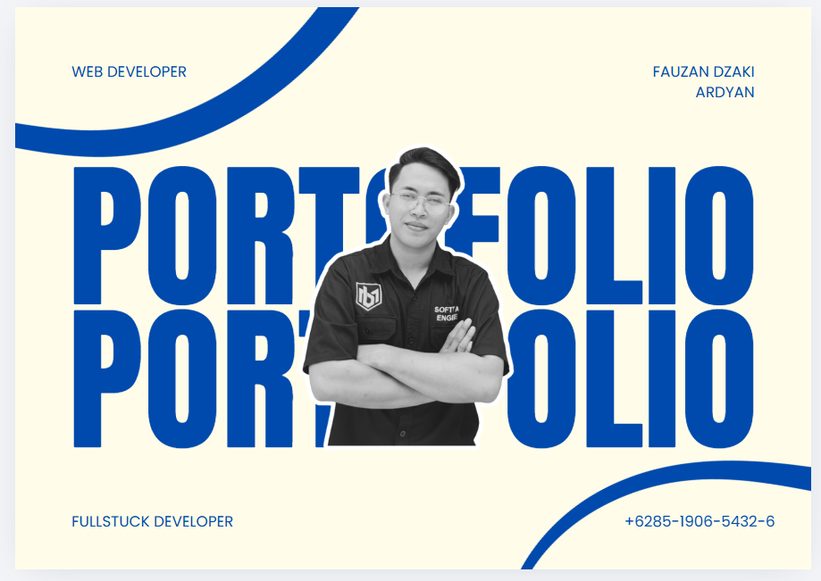

# 🌐 Premium Interactive Portfolio

A high-end, interactive portfolio website designed to deliver a **strong personal brand**, **modern user experience**, and **Awwwards-inspired visual storytelling**.

Built with cutting-edge web technologies, this project showcases not just content — but **craftsmanship, interaction, and attention to detail**.

---

## 🎯 Why This Project?

Most portfolios are static.
This one is designed to **stand out**.

It focuses on:

* First impression (Hero section)
* Smooth storytelling (scroll-based interaction)
* Engaging user experience (animations & micro-interactions)

👉 The goal: **make visitors remember you in seconds**

---

## ✨ Highlights

### 🎬 Cinematic Hero Section

* Bold **Anton typography**
* Layered layout (text + image overlap)
* Strong personal branding
* Smooth entrance animation

---

### 🌀 Awwwards-Style Scroll Experience

* Pinned sections with **zoom-out effect**
* Scroll-driven storytelling
* Seamless transitions between sections

---

### 🖱️ Interactive Projects Showcase

* Hover animations (zoom, overlay, motion)
* Focus on visual presentation
* Designed to attract attention instantly

---

### ⚡ Smooth & Premium Feel

* Fluid animations (60fps optimized)
* Micro-interactions on buttons and elements
* Clean and modern UI/UX

---

## 🛠️ Tech Stack

* **Next.js (App Router)** – modern React framework
* **Tailwind CSS** – fast and scalable styling
* **Framer Motion** – smooth UI animations
* **GSAP + ScrollTrigger** – advanced scroll interactions
* **next/image** – optimized image handling

---

## 🧠 What This Demonstrates

This project is not just a portfolio — it demonstrates:

* Advanced frontend development skills
* Animation and interaction design
* Clean code structure and scalability
* Attention to UI/UX detail
* Ability to build modern, production-ready interfaces

---

## 📸 Preview

<p align="center">
  
</p>

---

## 🚀 Live Demo

👉 Add your deployed link here (Vercel recommended)

---

## ⚙️ Getting Started

```bash
npm install
npm run dev
```

Open http://localhost:3000

---

## 📁 Project Structure

```bash
/app
/components
/sections
/animations
/hooks
/utils
```

---

## 💼 Use Case

This portfolio is ideal for:

* Personal branding
* Job applications (frontend / fullstack)
* Freelance showcase
* Client presentations

---

## 🤝 Let's Work Together

If you're looking for:

* A modern website
* Interactive UI/UX
* A professional frontend developer

Feel free to reach out 👇

📧 [your-email@example.com](mailto:your-email@example.com)
📱 +62 xxx-xxxx-xxxx

---

## 👨‍💻 Author

**Fauzan Dzaki**
Web Developer | Fullstack Developer

---
